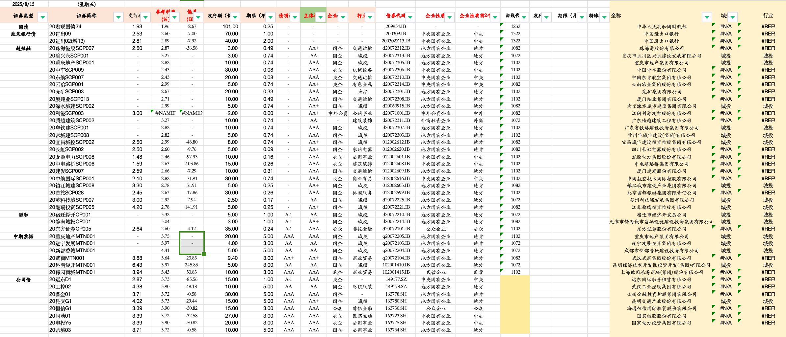

# Internship: Tianfeng Securities – Municipal Credit Analysis  

## 📌 Overview  
This repository documents my internship experience at **Tianfeng Securities Research Institute**, where I assisted senior analysts in researching **municipal SOEs (城投 companies)** and contributed to credit risk analysis reports. Its **Fixed Income Research Team has consistently ranked among the Top 2 in the country for over 5 consecutive years**, recognized by *New Fortune* and other prestigious industry awards. 

My work involved merging **quantitative financial modeling** with **qualitative policy insights**, including interviews with issuers and government entities.  

## 📝 Key Contributions  
- Assisted in preparing the research summary **“Summary of Research on Urban Investment Companies”** and contributed to case studies, including the **Yongmei default event**.  
- Coordinated with senior researchers to collect and analyze **first-hand issuer and government insights**, validating assumptions with data.  
- Supported **credit risk reports and PPT presentations**, which were delivered to institutional investors.  

## 🔧 Tools & Methods  

### Excel & Python Analysis  
- Built and cleaned datasets on 40+ municipal SOEs, covering revenue, debt maturity, cash flow, and fiscal support.  
- Applied **descriptive statistics** (growth rates, averages, ratios) and **trend analysis** to validate financial health over time.  
- Conducted **scenario testing/stress-testing** in Excel to measure repayment capacity under different fiscal support assumptions.

 

### Credit Risk Evaluation  
- Performed **financial ratio analysis** (debt-to-asset, interest coverage, operating margin, cash-to-debt) to benchmark issuers.  
- Assisted in **peer group comparisons** across regions and industries (construction, transportation, infrastructure).  
- Incorporated both **explicit guarantees** (local government commitments) and **implicit support likelihood** into risk assessments.  

### Qualitative Research & Validation  
- Summarized **interviews with issuers and local government finance bureaus** to capture on-the-ground insights.  
- Merged qualitative findings with quantitative outputs to refine **investment outlooks**.  
- Helped identify early warning signals such as liquidity strain, local fiscal pressure, and governance concerns.  

### Reporting & Presentation  
- Contributed to **structured slide decks** and draft sections of sell-side reports.  
- Supported senior researchers in delivering **credit differentiation and investment recommendations**.  

---

## 📂 Repository Content  
- [Urban Investment Companies_Research Summary.pdf](Urban%20Investment%20Companies_Research%20Summary.pdf) – Presentation summarizing research findings.  
- [永煤违约，还有哪些煤企风险较大？.pdf](永煤违约，还有哪些煤企风险较大？.pdf) – Report analyzing Yongmei’s default and related coal enterprise risks.  
- Supporting notes and datasets.  

---

## 🚀 Skills Demonstrated  
- Financial Modeling (Excel, Python)  
- Ratio & Stress Testing Analysis  
- Credit Risk Research (SOEs, LGFVs)  
- Report Writing & Presentation  
- Data Cleaning & Visualization  
